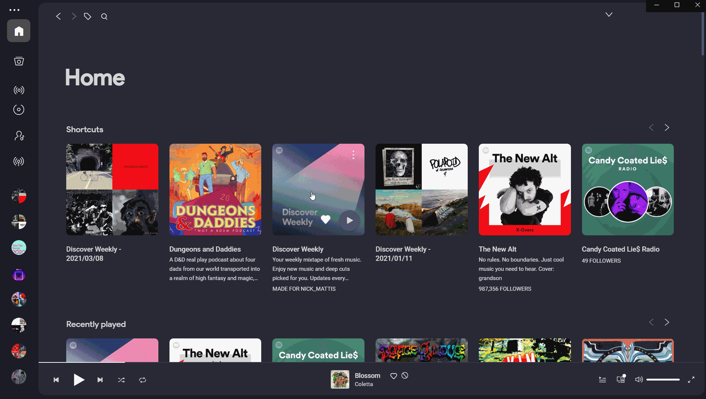

# spicetify-extensions
Custom extensions for spicetify-cli (https://github.com/khanhas/spicetify-cli)

## How to add extensions to Spicetify

1. [Install spicetify-cli using the instructions found here](https://github.com/khanhas/spicetify-cli/wiki/Installation)
2. Clone this repository or download the zip
3. Copy the js files to the spicetify extension folder, [paths to the extension folder for your os can be found here](https://github.com/khanhas/spicetify-cli/wiki/Extensions)
4. Open ```config.ini``` and add the name of the extension to the ```extensions``` line separated by ```|```
    ```
    [AdditionalOptions]
    ...
    extensions = saveDiscoverWeekly|...
    ```
    - OR add the extension by typing:
    ```
    spicetify config extensions saveDiscoverWeekly.js
    ```
5. Run `spicetify apply`

## saveDiscoverWeekly.js
Extension to add a context menu option on the discover weekly playlist to allow you to save it out every week to a playlist named `Discover Weekly - YYYY/MM/DD` where the date is the first day of the week.


